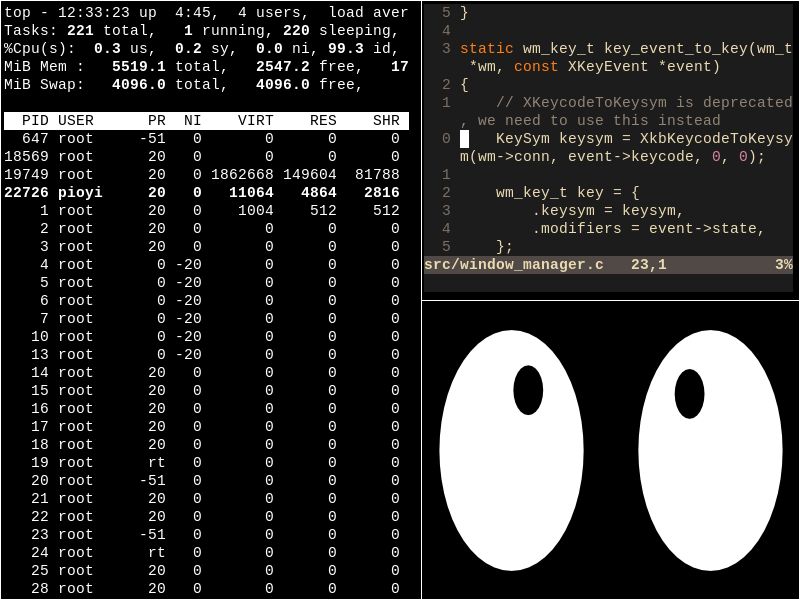

# Usage

We'll need to install `dmenu` (a lightweight graphical application
launcher), as well as `Xephyr` (a tool for interacting with
alternative X servers using ordinary, local windows). `Xephyr` will no
longer be needed once development is convenient enough within the
window manager itself! Within `Xephyr`, press `Ctlr + Shift` to
prevent the host X window manager from listening to your key strokes
and causing conflicts.

Similarly to `dwm`, the window manager is customizable through global
variables and symbolic constants defined in `config.h`.

- [x] Implement a simple tiling layout policy and focus key bindings (with color)
- [x] Support 9 numbered workspaces, just like dwm
- [ ] Modify `tile()` in order to insert gaps between windows. The user should be
  able to adjust the gap size at runtime, with a couple of key bindings.
- [ ] Implement floating windows (move, resize, toggle floating state),
  and make that the default for clients that present related hints
- [ ] Somehow make it stand out! Add something original

 

# Learning X11

## Resources

- [Chuan Ji's (incomplete) tutorial series](https://jichu4n.com/posts/how-x-window-managers-work-and-how-to-write-one-part-i/)
  is a great introduction to the topic, although it mostly covers the
  absolute basics.

- [aewmx](https://github.com/joshuaeckroth/aewmx/) is a window manager
  from the 90s. The author put great effort into documenting most of
  its functionality.

## Basic Concepts

> X11 or simply X is just a specification, an API and a set of
> carefully though-out rules used to make a windowing system possible.
> Most people mistakenly refer to it as `Xorg`. This is incorrect,
> since `Xorg` is just a particular widespread implementation of an
> X11 server!

An X **display** is defined as a workstation consisting of a keyboard,
a pointing device such as a mouse, and *one or more* screens. The
program that controls each display is known as the **server**, which
acts as an intermediate between user programs (called clients) and the
resources of the local system. The server does all the drawing! A
display user can also request a window from a remote server, and view
the result locally.

Applications communicate with the server by means of calls to a
low-level C library known as Xlib. These calls are translated to
TCP/IP requests sent either locally or across the network. All clients
except the window manager are called applications.

Client **requests** are generated by Xlib and sent to the server. They
may be drawing commands or queries for window dimensions. The server
might reply to some of these, which are known as *round-trip* requests
and tend to be slow (synchronous).

The X **server** might also generate **events**. These events are kept
in an internal queue. Events are suffixed by either `Notify` or
`Request`. `Notify` events represent something that has already
happened, so we can only react to them. Contrary to that, `Request`
events are instructions. No action has been taken just yet, the client
can either adhere to the command or completely ignore it!

Outgoing Xlib requests are **buffered** and efficiently flushed to
minimize network delays. When necessary, use `XFlush` or `XSync` to
perform that manually. Contrary to `XFlush`, `XSync` will wait until
all requests have been processed by the server. You can (but you most
likely won't need to) activate the `discard` argument to discard all
server events that are currently waiting to be processed by the
client. Every client will allocate space for an event queue for each
server that it is currently connected to.

The server manages a set of **resources**, which it then exposes
using simple integer IDs. If any client knows the ID of a resource,
they can freely manipulate it even if some other client had initially
created it. This is how window managers are implemented: they can move
and resize applications because they know their IDs.

A window manager **is just like any other client**, but with an
elevated set of privileges! Unlike ordinary applications, it is mostly
responsible of intercepting events sent from other clients in an
effort of applying its layout policy. For example, a tiling window
manager will usually ignore all client move and resize events: window
positioning is heavily regulated and can only be modified by a set of
special key bindings. Although this might initially seem annoying, it
makes total sense in practice since you won't have to deal with
overlapping windows ever again!

A window manager is also responsible for defining the desktop's
appearance. Some window managers, such as i3, will ship with
decorative title bars by default. Others, such as dwm, prefer to
minimize visual clutter, restricting themselves to just a single
optional status bar at the top. Most of them are impressively
configurable.

The developers of X needed a way to allow **clients to communicate
arbitrary data with each other**, and they came up with properties. A
property is a packet of information associated with a *window*, made
available to all clients running under a server. Properties have a
string name and a corresponding ID called an atom, in order to minimize
message sizes. An application can fetch the atom of a particular
property by calling `XInternAtom`, supplying the appropriate string
identifier. Some atoms are predefined and do not require a call: these
are all provided as symbolic constants, prefixed by `XA_`. This is an
important concept, since that's how our window manager will be able to
communicate information to top-level application windows and vice
versa.

The **root window** captures the entire screen and is created by the X
server automatically, once it starts up. Children of the root window,
which are controlled by the window manager, are specifically known as
top-level windows. Each window is given a unique ID. Scroll bars are
just nested windows! 

A newly created window is just an abstract entity. You need to **map
it** to actually get a chance of seeing it!

## Substructure Redirection

`SubstructureRedirectMask` will instruct the X server to send a
`MapRequest` event to our root window whenever any other client
attempts to create a top-level window. Note that this is a *request*,
not a *notify*. This means that we're given the privilege of either
satisfying it or totally ignoring it. Only one client (window manager)
can enable this mask at any given time, so that's why we need to abort
in case of failure.

Substructure redirection is what allows us to intercept map events so
that we can effectively wrap top-level windows into frames. Frames
usually consist of minimize, maximize and exit buttons along with a
border and a window title. It would have been illogical to target
non-top-level windows, since these are nothing more than buttons,
scroll bars, input fields etc.

`SubstructureNotifyMask` will make events associated with
modifications of top-level windows accessible to our root window, i.e.
the second parameter of our call to `XSelectInput`. We can then listen
to `ConfigureRequest` events and apply our layout policy! Note that
`XMoveResizeWindow` events, as described in the `wm_tile()` function,
*will not* generate `ConfigureRequest` events.

## Input Handling

Each window must declare all keys that it expects to receive
beforehand. That's why our window manager keybindings should be
defined through calls to `XGrabKey` on our root window, during setup.

Keycodes are just integer identifiers used to represent a particular
key position on the keyboard. They are completely ignorant of the
key's content. That's why you should prefer working with KeySyms,
which represent characters in a portable, cross-keyboard fashion
(`XK_a`, `XK_space` and so on). Most Xlib routines require a keycode,
so a call to `XkbKeycodeToKeysym` is required. Note that
`XKeycodeToKeysym` is deprecated.

## Client-WM Communication 

In addition to X11 events, some clients might support a list of
additional protocols. These protocols are enabled by clients that need
to be explicitly notified when certain conditions are met.

A list of supported protocols is set by a client by a call to
`XGetWMProtocols()`, which populates a list of atoms, the presence of
each representing whether the client is interested in receiving said
event.

For example, some clients register interest for `WM_DELETE_WINDOW`
because they prefer doing some clean-up work before being destroyed by
the window manager. Whenever the exit key binding is pressed, the
window manager is responsible of first querying the list of supported
protocols of the window being destroyed. If `WM_DELETE_WINDOW` is
present, the WM should just send a `ClientMessage`. Otherwise,
the WM is required to abruptly destroy the window via a call to
`XKillClient`.

### Window Focus

Our tiling window manager will need to update the focus when new
windows are created without the user having to manually move the mouse
there. An `XSetInputFocus` might just be enough. We provide
`RevertToPointerRoot` so that we focus back to our root when the
windows ceases to be visible.

Remember how atoms are used to communicate between other clients and
the WM? Well, some applications might need to query which window is
currently on focus and if that's not them, alter some visual aspect of
their UI. That's why we always need to keep the `NET_ACTIVE_WINDOW`
property of our root window up to date at all times. The
`XChangeProperty` function expects a list of values, 32-bit in this
case. We'll just provide a single argument of type `XA_WINDOW`.

We should also focus on windows that have just been hovered by the
cursor, which is done using `EnterNotify` events.

#### Colormaps and Border Color

An Xlib colormap is a data structure that associates integer indices
with RGB color values. We need to make sure that our desired colors
are available on our default colormap. A default colormap is created
for each display connected to our server and can be queried through
`DefaultColormap()`.

`XAllocNamedColor` will first convert the human-readable color
nickname (e.g. "red") into an exact RGB value. Then, once the RGB
value is known, it will allocate a color on the provided colormap and
return an `XColor` structure, containing the associated colormap index
(held in the `pixel` field) which can finally be used to modify the
color of some graphical elements (including window borders).

## Layout Policy

I'm not entirely sure if I did this correctly, but it works fine for
now. Basically, I created a `tile` function which iterates over all
workspace windows and re-calculates their geometry, which is then
updated through `XMoveResizeWindow` calls. The "special" window is
given a column of its own, while the rest of the applications share
the remainder of the screen. This is a common layout for most tiling
window managers out there.

Special care had to be taken when a window is first mapped, because
the X server most often failed to make it visible before our
`client_focus` call. An explicit `XSync` fixed it!

## Workspace Switching

Each workspace must only keep track of its clients, along with its
active layout configuration and a pointer to the client currently in
focus. When switching between workspaces, we just need to iterate over
the active client list and unmap (not destroy!) every single frame
window. Unmapping is recursive, so the underlying windows will
immediately become invisible as well.
